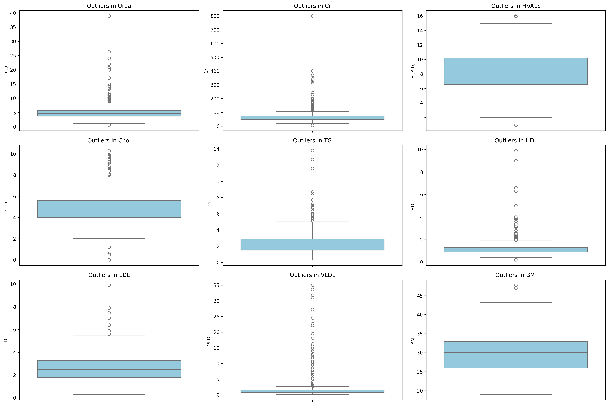
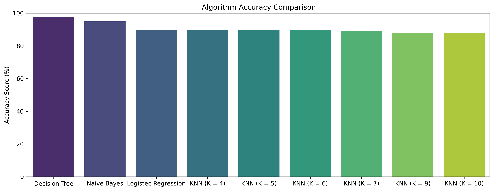
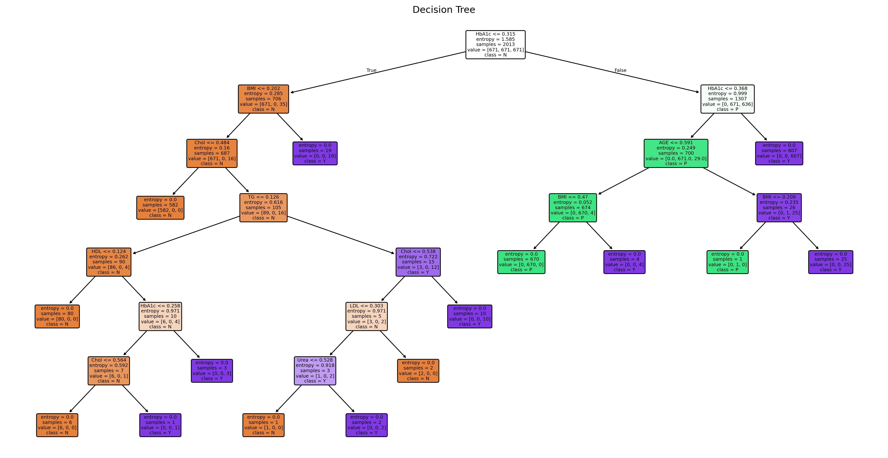
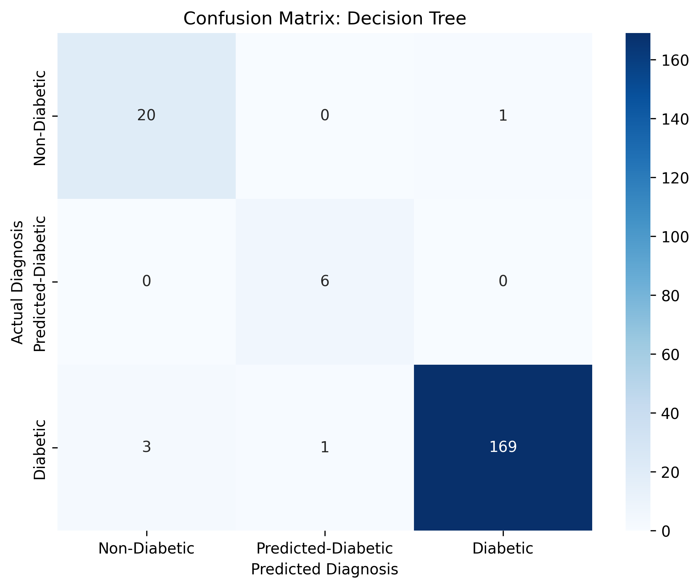
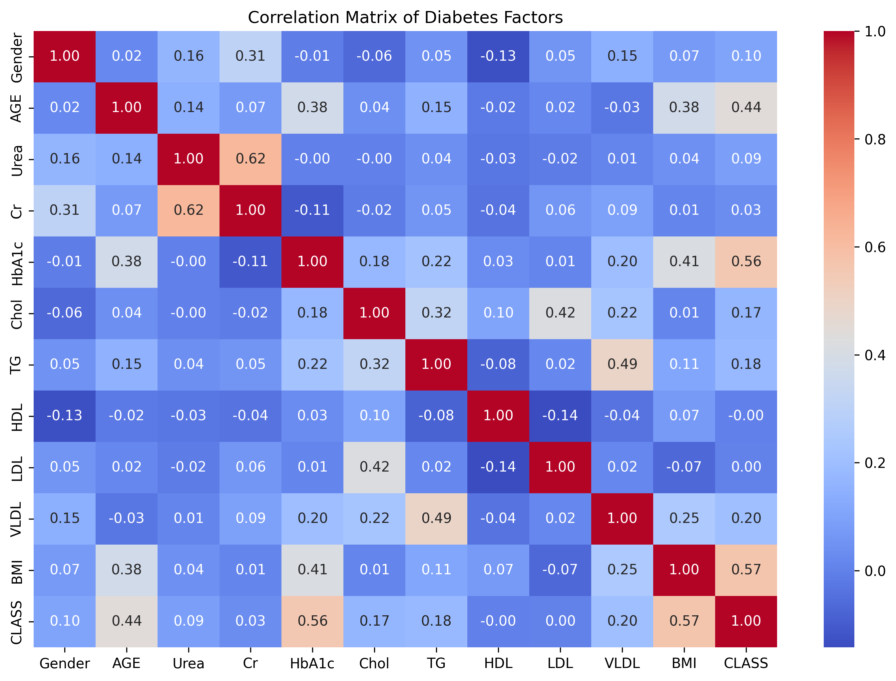
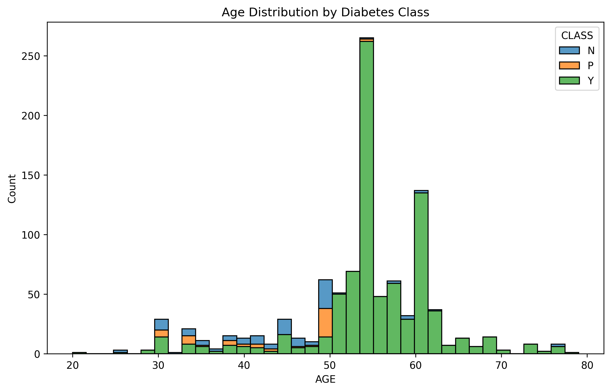

# Unified Technical Report: Predictive Analytics for Diabetes Diagnosis
**Course:** Data Mining (Spring 2026)  
**Instructional Lead:** Prof. Walaa Khaled | **TA:** Esraa Karam  

### Project Metadata
The following team members contributed to the iterative development of this diagnostic model:

| Department | Section | Level | ID | Member Name |
| :--- | :--- | :--- | :--- | :--- |
| SWE | Section 2 | Level 2 | 20241701835 | عمر أحمد محمد عبداللطيف |
| SWE | Section 2 | Level 2 | 20241701852 | يوسف وليد ممدوح حبيب |
| SWE | Section 2 | Level 2 | 20241701832 | عبدالله سمير محمد ابراهيم |
| SWE | Section 2 | Level 2 | 20241701848 | ياسين عمرو محمد عبدالغني |
| SWE | Section 2 | Level 2 | 20241701823 | زياد محمد عبدالرحمن محمد |
| SWE | Section 2 | Level 2 | 20241701837 | عمرو بهاء ابراهيم عبد الرازق |

---

## 1. Methodology: Establishing a Clean Baseline

Data mining in healthcare requires a smart, human-level approach. We recognized that this dataset carries a **"Sick Patient Bias"**—since people generally visit clinics only when they feel unwell, the data naturally contains more diabetic cases than healthy ones. Our methodology focused on refining this data into a balanced, clean baseline.

### 1.1 Data Exploration (Raw State)
Before processing, we examined the raw medical records. The dataset included clinical markers alongside administrative identifiers that do not impact health results.

  
*Observation: Raw data contains administrative columns like ID and No_Pation which act as noise for predictive modeling.*

### 1.2 Iterative Cleaning & Selection
*   **Removing Identifiers:** We dropped `ID` and `No_Pation`. Keeping these unique markers led the **model** to "memorize" specific patients rather than learning biological trends.
*   **Label Cleaning:** We used `.str.strip()` to fix the `CLASS` and `Gender` columns. Manually entered data often contains accidental spaces; removing these prevented the **model** from misinterpreting results.

### 1.3 Outlier Handling: Comparative Analysis
Clinical data is prone to extreme readings. To handle this properly, we performed a comparative analysis using two different detection methods.

*   **The Comparison:** As shown in our analysis, the **IQR method** was much more sensitive. For example, in Urea, IQR found 65 outliers while Z-Score only found 19.
*   **Smart Reasoning:** We chose **IQR** because it relies on the actual spread of our data (quartiles). The Z-Score assumes a perfect "Bell Curve" distribution, which is rarely the case in medical datasets where specific markers are naturally skewed.
*   **The Fix (Capping):** Instead of deleting records, we "capped" values at the IQR boundaries. This preserved our sample size while ensuring the **model** wasn't distracted by noisy extremes.

  
*Observation: Boxplots clearly show the skewed nature of clinical markers like Creatinine (Cr) and Urea.*

---

## 2. The Preprocessing Milestone: Balancing the Scales

A human-level reality of this data is that healthy people rarely get tested. This created a major imbalance:
*   **Diabetic (Y): 671 | Non-Diabetic (N): 80 | Predicted-Diabetic (P): 49**

**The SMOTE Solution:** Without intervention, the **model** would ignore the "Predicted" group. We used **SMOTE** to synthetically balance the classes to **671 records each**. This ensures the **model** identifies people at risk (Predicted) before they become fully diabetic.

---

## 3. Implementation & Results: Why the Decision Tree Won?

We tested four mathematical approaches. While all were strong, the **Decision Tree** was the most effective (~97.5% Accuracy).

**Why it outperformed the others:**
*   **Vs. Naive Bayes:** Naive Bayes assumes markers are independent. However, BMI and blood sugar are biologically linked. The Decision Tree naturally understands these connections.
*   **Vs. KNN:** KNN looks at "distance." In crowded medical data, healthy and sick points overlap. The Decision Tree cuts through this by using precise clinical thresholds.
*   **The Logic:** A Decision Tree mirrors a doctor’s thought process (*Check blood sugar -> check BMI*). This logical sorting made it the best fit.

  
*Observation: The model identifies HbA1c as the primary factor in medical diagnosis.*

---

## 4. Evaluation & Final Insights

### 4.1 Accuracy and Validation
We used a **Confusion Matrix** to see where the **model** made mistakes. It correctly identified almost every diabetic patient, with nearly zero "false negatives"—the most dangerous error in healthcare.

### 4.2 Human-Level Insights
*   **Age and Risk:** We observed that while age is a factor, a notable **15.4%** of people under 40 were already diabetic, highlighting the importance of metabolic markers over chronological age.

---

## 5. Conclusion
By refining the data, evaluating outlier methods to choose IQR, and balancing the "Sick Patient Bias" through SMOTE, we built a tool with a **97.5% success rate**. The **Decision Tree** proved to be the best **model** because its logic mirrors the reality of medical diagnosis.
